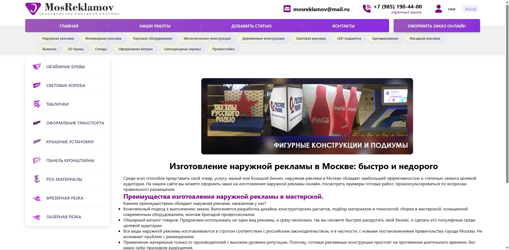
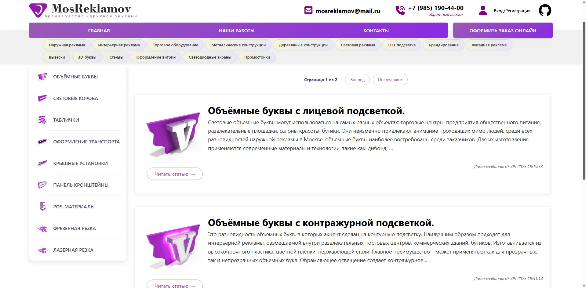
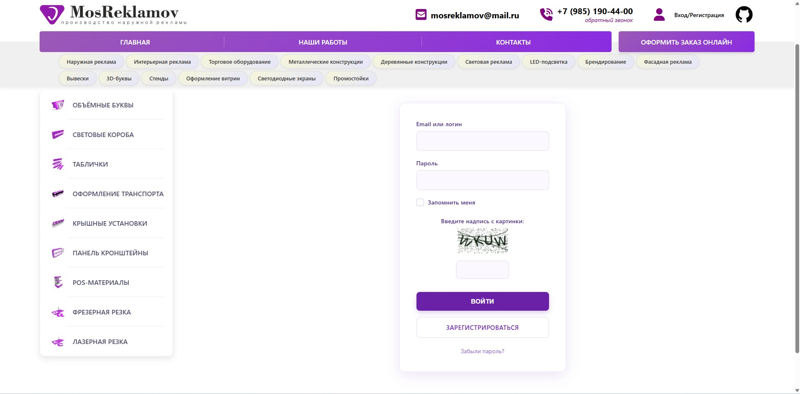
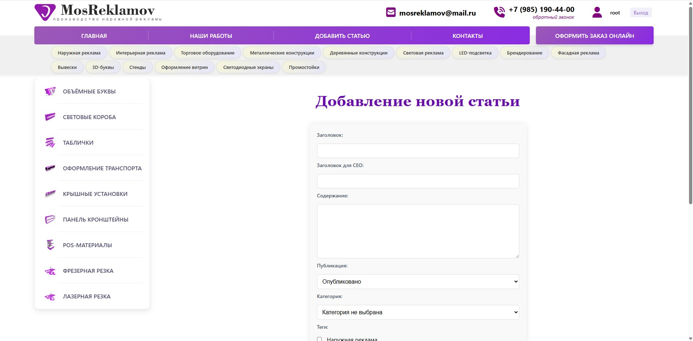
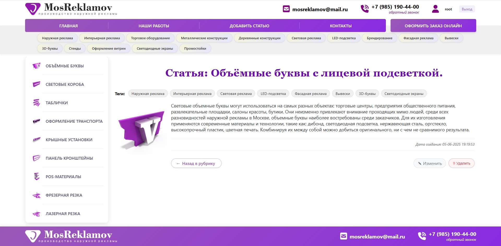

# 🚀 MosReklamov — мой первый Django-проект  

**Учебный проект** — сайт о наружной рекламе в Москве с базовым функционалом блога.  

👉 **Первый опыт работы с Django**, поэтому код и архитектура далеки от идеала.  

---

## 📌 Что реализовано  

- **Главная страница** с информацией об услугах  
- **Простой блог** со статьями  
- **Авторизация** через почту или GitHub + капча  
- **Восстановление пароля** через email
- **Админка** стандартная Django Admin 

---

## 🔧 Технологии  

- **Backend**: Django (Python)  
- **Frontend**: HTML, CSS, немного JS  
- **База данных**: PostgreSQL
- **Аутентификация**: Django Allauth
- **Дополнительно**: Поддержка Docker (образ можно собрать локально)

---

## 📸 Скриншоты интерфейса

### Основные разделы
| Главная страница | Блог |
|------------------|------|
|  |  |

### Система пользователей
| Авторизация | Регистрация |
|-------------|-------------|
|  |  |

### Работа с контентом
| Добавление статьи | Пример статьи |
|-------------------|---------------|
|  |  |

---

## ⚠️ Ограничения  

1. Нет адаптивной вёрстки (только десктоп).  
2. Код требует рефакторинга (это мой первый проект).  
3. Нет тестов.  

---  

## 🌟 Автор  

**Никита Соболев** · [GitHub](https://github.com/Nikita-W-Sobolev)  

💡 **Цель проекта**: обучение Django + Docker + деплой на своём сервере.  